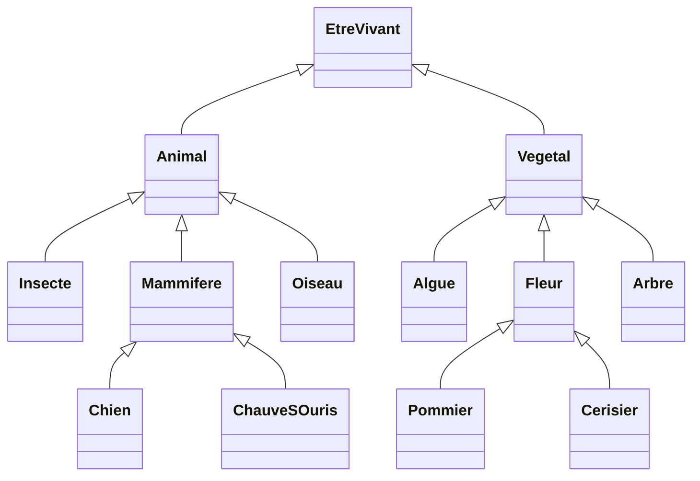
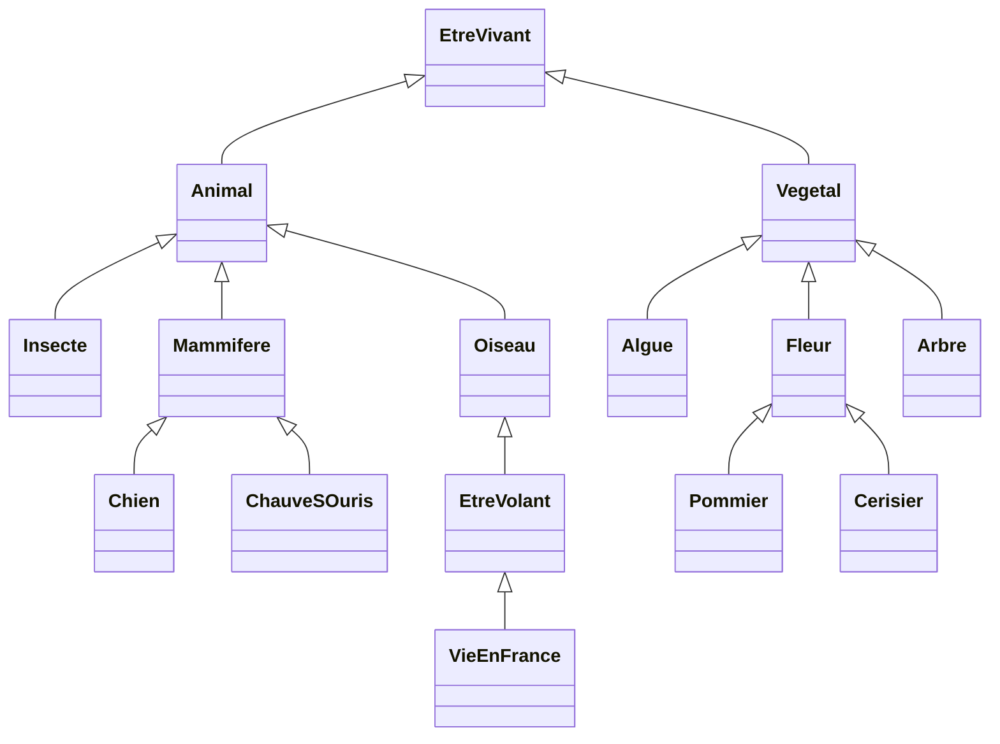
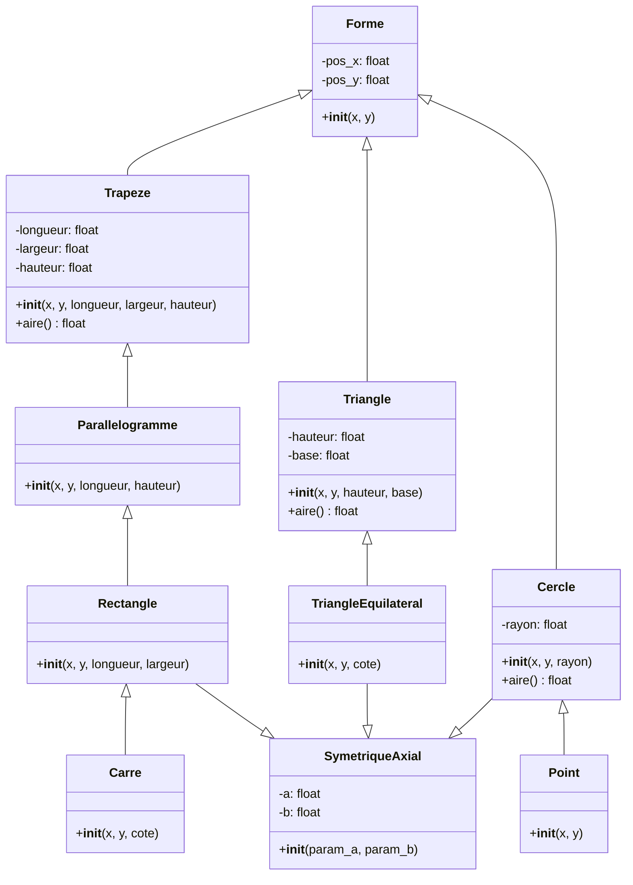

# Programmation Orientée Objet en Python

## Table des matières

### Concepts fondamentaux
1. **Philosophie de la POO** - Principes et fondamentaux
2. **Définition d'une classe** - Syntaxe et structure
3. **Création d'un objet** - Instanciation
4. **Référence à l'instance (self)** - Convention et utilisation
5. **Membres spéciaux** - Attributs et méthodes spéciales
6. **Constructeur** - Initialisation avec `__init__`
7. **Création à la volée** - Ajout/suppression dynamique de membres

### Fonctionnalités avancées des classes
8. **Fonctions membres de classe** - Décorateur `@classmethod`
9. **Destructeur** - Nettoyage avec `__del__`
10. **Représentation d'un objet** - Méthodes `__repr__` et `__str__`
11. **Surcharge d'opérateurs mathématiques** - Opérateurs `+`, `-`, `*`, `/`, etc.
12. **Surcharge d'opérateurs de comparaison** - Opérateurs `==`, `!=`, `<`, `>`, etc.
13. **Surcharge d'opérateurs logiques** - Opérateurs `&`, `|`, `^`, `~`
14. **Encapsulation et abstraction** - Contrôle d'accès et masquage

### Propriétés et méthodes spécialisées
15. **Propriétés (@property)** - Getters, setters et calculs
16. **Méthodes statiques (@staticmethod)** - Fonctions indépendantes de la classe

### Concepts avancés
17. **Polymorphisme** - Plusieurs formes, une interface
18. **Composition vs Héritage** - Quand utiliser quoi
19. **Classes abstraites (ABC)** - Interfaces et contrats

### Itération et types
20. **Itérateurs et générateurs** - Parcourir les séquences
21. **Type hints et annotations** - Documentation des types

### Bonnes pratiques
22. **Conventions et bonnes pratiques** - PEP 8, SOLID, gestion d'erreurs

### Héritage
23. **Héritage** - Concepts et réutilisation
24. **Héritage simple** - Syntaxe et exemples
25. **Résumé de l'héritage simple** - Récapitulatif
26. **Utilitaires d'héritage** - `super()`, `issubclass()`, `isinstance()`
27. **Fonction super()** - Meilleure pratique
28. **Héritage multiple** - Plusieurs parents
29. **Remarques** - Membres privés, ambiguïtés, hiérarchies

### Exercices
30. **Exercice : Géométrie 2D** - Projet complet avec héritage

---

## 1. Philosophie de la POO

### 1.1 Principes fondamentaux

La POO est une approche pour **organiser et structurer le code** autour d'objets qui combinent données et comportement. C'est particulièrement utile pour :
- **Modéliser le monde réel** (une voiture a des propriétés et des actions)
- **Réutiliser du code** (héritage, composition)
- **Limiter les bugs** (encapsulation, contrôle d'accès)
- **Améliorer la maintenabilité** (code organisé et logique)

Points clés :
- Dans la programmation orientée objet (POO), **toutes les variables sont des objets** associés à une classe
- Une **classe** est un **plan** (blueprint) qui décrit le type
- Un **objet** est une **instance concrète** créée à partir de ce plan

### 1.2 Qu'est-ce qu'un objet ?

Un objet encapsule deux choses :
- **Données membres** (ou **attributs**) : l'**état** de l'objet (ce qu'il contient)
- **Fonctions membres** (ou **méthodes**) : le **comportement** de l'objet (ce qu'il peut faire)

Exemple concret : une voiture
- **Attributs** : couleur, marque, vitesse, carburant
- **Méthodes** : accélérer(), freiner(), remplir_reservoir()

### 1.3 Instances et classes

**Classe vs Instance :**
- **Classe** : le moule (générique, réutilisable)
- **Instance** : l'objet fabriqué à partir du moule (spécifique, concret)

Analogue : si la classe est la "recette de gâteau", chaque instance est un "gâteau réel". On peut faire 100 gâteaux identiques à partir d'une seule recette.

Remarques :
- On peut créer **autant d'instances** d'une classe que nécessaire
- Chaque instance a ses **propres données** (un gâteau peut avoir du glaçage rose, un autre blanc)
- En Python, **tout est objet** : les nombres, les chaînes, les listes, vos classes personnalisées...

---

## 2. Définition d'une classe

### 2.1 Syntaxe de base

Pour définir une classe, on utilise le mot-clé `class` suivi du nom (convention : PascalCase) et de `:` :

```python
class MaClasse:
    """Documentation brève de la classe."""
    pass
```

- Le **docstring** (entre `"""..."""`) est optionnel mais recommandé
- Les classes vides peuvent contenir juste `pass` (ne rien faire)
- Cette classe est maintenant un nouveau **type** que vous pouvez utiliser

### 2.2 Ajouter des membres

On ajoute des **attributs** et des **méthodes** (fonctions) à la classe :

```python
class MaClasse:
    """Documentation brève de la classe."""

    def fonction_membre(self):
        """Une fonction membre simple."""
        print('Hello')
```

Explication :
- `fonction_membre` est une **méthode** (fonction liée à la classe)
- `self` représente l'instance sur laquelle la méthode est appelée
- On peut appeler cette méthode sur toute instance de `MaClasse`

**À retenir :** Les méthodes sont définies **à l'intérieur** de la classe avec l'indentation appropriée.

---

## 3. Création d'un objet

### 3.1 Instanciation

On crée une instance (ou objet) de classe en **appelant le nom de la classe** comme une fonction :

```python
une_instance = MaClasse()
```

Ce qui se passe :
1. Python crée une nouvelle instance vide de `MaClasse`
2. Python appelle le constructeur `__init__()` si défini (voir section 6)
3. L'instance est retournée et stockée dans `une_instance`

Chaque appel crée une **nouvelle instance** avec ses propres données (indépendante des autres).

### 3.2 Accès aux membres

On accède aux **attributs** et **méthodes** d'une instance avec l'opérateur `.` (point) :

```python
une_instance.fonction_membre()  # appelle la méthode, affiche 'Hello'
```

L'opérateur `.` signifie : "accès au membre de cette instance". C'est le moyen principal d'interagir avec un objet.

---

## 4. Référence à l'instance (self)

### 4.1 Paramètre self

`self` est le **premier paramètre de toute méthode** et représente l'**instance elle-même** :

```python
def fonction_membre(self):
    pass  # self = l'instance sur laquelle la méthode est appelée
```

C'est comment Python sait "à qui" la méthode appartient. Sans `self`, on ne saurait pas sur quel objet opérer.

### 4.2 Appel automatique

Python ajoute **automatiquement** l'instance comme premier argument :
- Vous appelez : `une_instance.fonction_membre()`
- Python exécute : `MaClasse.fonction_membre(une_instance)`

Vous n'écrivez **jamais** `une_instance.fonction_membre(une_instance)` - c'est automatique.

### 4.3 Traduction automatique

Exemple concret :
```python
une_instance.fonction_membre()   # Ce que vous écrivez
MaClasse.fonction_membre(une_instance)  # Ce que Python exécute
```

Les deux sont **équivalentes**, mais la première forme est l'usage standard.

### 4.4 Convention et utilisation

**Règles importantes :**
- `self` n'est jamais un mot-clé - c'est juste une convention (mais suivez-la absolument)
- `self` donne accès à **tous les attributs et méthodes** de l'instance via la notation `.`
- À l'intérieur d'une méthode, `self` désigne **l'instance actuelle**

Exemple pratique :
```python
class Voiture:
    def __init__(self):
        self.couleur = "rouge"    # attribut spécifique à cette instance

    def afficher_couleur(self):
        print(self.couleur)       # accès à l'attribut via self
```

```python
class MaClasse:
    """Exemple d'utilisation de self."""
    donnee_commune = 0

    def fct_sur_instance(self):
        """Modifie les données d'instance et de classe."""
        self.donnee_instance = 1
        MaClasse.donnee_commune += 1

instance1 = MaClasse()              # donnee_commune = 0, donnee_instance n'existe pas
instance1.fct_sur_instance()        # donnee_commune = 1, instance1.donnee_instance = 1
instance2 = MaClasse()              # donnee_commune = 1, donnee_instance n'existe pas
instance2.fct_sur_instance()        # donnee_commune = 2, instance2.donnee_instance = 1
```

---

## 5. Membres spéciaux

Les données et fonctions qui commencent par un double tiret-bas (`__`) sont des membres spéciaux avec un sens particulier.

### 5.1 Données membres spéciales

- **`__doc__`** : documentation de la classe (donnée par la docstring)
- **`__name__`** : nom de la classe
- **`__dict__`** : dictionnaire où les clés sont les noms des données membres et les valeurs sont leurs contenus

---

## 6. Constructeur

### 6.1 Définition

Le **constructeur** est une **méthode spéciale** appelée automatiquement lors de la création d'une instance :
- Se nomme toujours `__init__` (initialise = initialize)
- Appelée **automatiquement** quand on crée une instance
- Sert à **initialiser les attributs** de l'objet
- Retourne implicitement `self` (l'instance créée)

**Sans constructeur :** l'instance est vide. **Avec constructeur :** on peut paramétrer l'instance à sa création.

### 6.2 Initialisation simple

```python
class NombreComplexe:
    """Représente un nombre complexe."""

    def __init__(self):
        """Initialise les parties réelle et imaginaire à zéro."""
        self.re = 0       # attribut
        self.im = 0       # attribut

nc = NombreComplexe()     # __init__ est appelé automatiquement
print(nc.re)              # 0
```

Ce qui se passe : Python crée une instance vide, puis appelle `__init__()` pour l'initialiser.

### 6.3 Initialisation avec paramètres

Le constructeur **reçoit des paramètres** pour initialiser l'objet selon les besoins :

```python
class NombreComplexe:
    """Représente un nombre complexe avec parties réelle et imaginaire."""

    def __init__(self, re, im):
        """Initialise le nombre complexe avec ses parties."""
        self.re = re      # attribut reçoit la valeur du paramètre
        self.im = im      # attribut reçoit la valeur du paramètre

nc1 = NombreComplexe(2, 4)      # re=2, im=4
nc2 = NombreComplexe(5, -3)     # re=5, im=-3

print(nc1.re)   # 2
print(nc2.re)   # 5
```

Chaque instance a ses **propres attributs** avec les valeurs passées au constructeur.

---

## 7. Création à la volée

### 7.1 Ajouter des données membres

**Particularité de Python :** on peut ajouter des attributs à une instance **après sa création**, même s'ils ne sont pas définis dans la classe :

```python
class Voiture:
    pass

v = Voiture()
v.marque = "Toyota"      # Ajout dynamique d'un attribut !
v.annee = 2020           # Ajout d'un autre
print(v.marque)          # "Toyota"
```

**Important :** Cet attribut n'existe que pour **cette instance** :
```python
v1 = Voiture()
v1.couleur = "rouge"
print(v1.couleur)        # "rouge" OK

v2 = Voiture()
print(v2.couleur)        # ERREUR ! v2 n'a pas d'attribut couleur
```

**Conseil :** Bien que possible, c'est mauvaise pratique. Définissez tous les attributs dans `__init__()` pour la clarté.

### 7.2 Supprimer des données membres

On peut **supprimer des attributs** avec l'instruction `del` :

```python
v = Voiture()
v.couleur = "bleu"
print(v.couleur)         # "bleu"

del v.couleur            # Supprime l'attribut
print(v.couleur)         # ERREUR ! couleur n'existe plus
```

`del` fonctionne sur :
- Les attributs d'instances
- Les méthodes (rarement utile)
- Les instances elles-mêmes

---

## 8. Fonctions membres de classe

### 8.1 Définition

Il existe la possibilité d'avoir des **fonctions membres de classe** (communes aux instances) :
- Le premier paramètre s'appelle `cls` (pour classe)
- On indique à Python que c'est une fonction de classe grâce au décorateur `@classmethod`
- On l'appelle avec l'opérateur `.` sur la classe ou sur une instance

### 8.2 Exemple

```python
class NombreComplexe:
    """Nombre complexe avec comptage des instances."""

    nb_complexes_crees = 0

    def __init__(self):
        """Initialise et incrémente le compteur."""
        self.re = 0
        self.im = 0
        NombreComplexe.nb_complexes_crees += 1

    @classmethod
    def affiche_nb_complexe(cls):
        """Affiche le nombre de complexes créés."""
        print(NombreComplexe.nb_complexes_crees)

NombreComplexe.affiche_nb_complexe()   # affiche 0
nc1 = NombreComplexe()
NombreComplexe.affiche_nb_complexe()   # affiche 1
nc2 = NombreComplexe()
NombreComplexe.affiche_nb_complexe()   # affiche 2
nc2.affiche_nb_complexe()              # fonctionne aussi
```

---

## 9. Destructeur

### 9.1 Définition

Parmi les fonctions spéciales, il y a aussi le **destructeur** de la classe :
- Porte le nom : `__del__`
- Appelée lorsque vous demandez la destruction explicite : `del nc1`
- Appelée automatiquement en sortant de la portée de l'objet
- Habituellement utilisé pour effectuer des actions avant la destruction

### 9.2 Exemple

```python
class NombreComplexe:
    """Nombre complexe avec destructeur."""

    def __init__(self):
        """Initialise le nombre complexe."""
        self.re = 0
        self.im = 0

    def __del__(self):
        """Affiche un message lors de la destruction."""
        print("Un nombre complexe a été détruit")
```

---

## 10. Représentation d'un objet

### 10.1 Le problème

Un simple `print` sur l'objet affiche :

```python
nc1 = NombreComplexe()
print(nc1)
# Affiche : <__main__.NombreComplexe object at 0x00AC45B70>
```

Pas très utile...

### 10.2 La solution

Deux fonctions membres spéciales permettent de contrôler comment l'objet est représenté et affiché à l'écran :

---

## 11. Méthode `__repr__`

Retourne la chaîne de caractère à afficher lorsqu'on tape directement le nom de l'objet (plutôt pour le debug) :

```python
class NombreComplexe:
    """Nombre complexe avec représentation personnalisée."""

    def __init__(self, re, im):
        """Initialise le nombre complexe."""
        self.re = re
        self.im = im

    def __repr__(self):
        """Retourne une représentation lisible du nombre complexe."""
        signe = '+' if self.im >= 0 else ''
        return f"{self.re}{signe}{self.im}i"

nc1 = NombreComplexe(5, 2)
nc2 = NombreComplexe(5, -2)
nc1  # affiche 5+2i
nc2  # affiche 5-2i
```

---

## 12. Méthode `__str__`

Retourne la chaîne de caractère à afficher lorsqu'on appelle la fonction `print` sur l'objet :

```python
class NombreComplexe:
    """Nombre complexe avec affichage personnalisé."""

    def __init__(self, re, im):
        """Initialise le nombre complexe."""
        self.re = re
        self.im = im

    def __str__(self):
        """Retourne une chaîne formatée pour print()."""
        signe = '+' if self.im >= 0 else ''
        return f"{self.re}{signe}{self.im}i"

nc1 = NombreComplexe(5, 2)
print(nc1)  # affiche 5+2i
```

---

## 13. Surcharge d'opérateur

### 13.1 Motivation

La **surcharge d'opérateur** permet à vos classes de supporter les opérateurs comme `+`, `-`, `*`, `==`, etc., comme les types built-in de Python.

**Avantages :**
- Syntaxe naturelle et intuitive
- Code lisible : `a + b` au lieu de `a.ajouter(b)`
- Consistance avec les types Python existants

Exemple : si vous créez une classe `Vecteur`, vous voulez faire `v1 + v2` et non `v1.ajouter(v2)`.

### 13.2 Approche

Plutôt que :
```python
# Mauvais : peu naturel
nc3 = nc1.additionner_avec(nc2)
```

Vous pouvez faire :
```python
# Bon : naturel et lisible
nc3 = nc1 + nc2
```

Comment ? En définissant une méthode spéciale `__add__` dans la classe.

**Fondamental :** Décidez **ce que signifie** chaque opérateur pour votre classe. L'addition pour un Vecteur n'est pas la même que pour une Chaîne.

---

## 14. Surcharge d'opérateurs mathématiques

### 14.1 Addition avec `__add__`

La méthode `__add__` définit le comportement de l'opérateur `+` :

```python
class NombreComplexe:
    """Nombre complexe avec opérateurs mathématiques."""

    def __init__(self, re, im):
        """Initialise le nombre complexe."""
        self.re = re
        self.im = im

    def __add__(self, operande_droite):
        """Additionne deux nombres complexes."""
        # self = opérande de gauche, operande_droite = opérande de droite
        resultat = NombreComplexe(self.re, self.im)
        resultat.re += operande_droite.re
        resultat.im += operande_droite.im
        return resultat

nc1 = NombreComplexe(5, 2)
nc2 = NombreComplexe(-1, 1)
nc3 = nc1 + nc2            # Appelle nc1.__add__(nc2)
```

Remarques :
- `self` est l'opérande **gauche** (le premier opérande)
- `operande_droite` est l'opérande **droite** (le second opérande)
- La méthode retourne un **nouvel objet** (ne modifie pas les originals)

### 14.2 Autres opérations mathématiques

Tous ces opérateurs peuvent être surchargés :

| Opérateur | Méthode | Exemple |
|-----------|---------|---------|
| `+` | `__add__` | `a + b` |
| `-` | `__sub__` | `a - b` |
| `*` | `__mul__` | `a * b` |
| `/` | `__truediv__` | `a / b` |
| `//` | `__floordiv__` | `a // b` |
| `%` | `__mod__` | `a % b` |
| `**` | `__pow__` | `a ** b` |

### 14.3 Opérateurs composés (avec affectation)

Pour les opérateurs qui **modifient** l'objet original :

```python
class Nombre:
    def __init__(self, valeur):
        self.valeur = valeur

    def __iadd__(self, autre):
        """Implémente += : modifie et retourne self"""
        self.valeur += autre.valeur
        return self

n1 = Nombre(5)
n2 = Nombre(3)
n1 += n2  # Appelle n1.__iadd__(n2) : n1 devient 8
```

**Différence importante :**
- `__add__` : crée un **nouvel objet** (`a + b` crée `c`)
- `__iadd__` : modifie l'objet **en place** (`a += b` modifie `a`)

Opérateurs composés disponibles :
- `__iadd__` pour `+=`
- `__isub__` pour `-=`
- `__imul__` pour `*=`
- etc.

---

## 15. Surcharge d'opérateurs de comparaison

Les **opérateurs de comparaison** permettent de comparer deux objets de votre classe. Ils retournent **toujours un booléen** (`True` ou `False`).

### 15.1 Les opérateurs disponibles

| Opérateur | Méthode | Signification |
|-----------|---------|---------------|
| `==` | `__eq__` | Égalité (égal à) |
| `!=` | `__ne__` | Inégalité (différent de) |
| `<` | `__lt__` | Inférieur (strict) |
| `<=` | `__le__` | Inférieur ou égal |
| `>` | `__gt__` | Supérieur (strict) |
| `>=` | `__ge__` | Supérieur ou égal |

### 15.2 Exemple d'implémentation

```python
class NombreComplexe:
    """Nombre complexe avec comparaisons."""

    def __init__(self, re, im):
        self.re = re
        self.im = im

    def __eq__(self, nc):
        """Égalité : deux complexes sont égaux si parties égales."""
        if not isinstance(nc, NombreComplexe):
            return False
        return self.re == nc.re and self.im == nc.im

    def __lt__(self, nc):
        """Inférieur : comparaison du module (distance de 0)."""
        import math
        module_self = math.sqrt(self.re**2 + self.im**2)
        module_nc = math.sqrt(nc.re**2 + nc.im**2)
        return module_self < module_nc

nc1 = NombreComplexe(3, 4)    # module = 5
nc2 = NombreComplexe(1, 1)    # module ≈ 1.41
print(nc1 == nc2)  # False
print(nc1 < nc2)   # False (5 < 1.41 est faux)
```

**Conseil :** `__eq__` est **crucial** - implémentez-le toujours pour pouvoir tester l'égalité de vos objets.

---

## 16. Surcharge d'opérateurs logiques

Les **opérateurs logiques binaires** sur les bits (`&`, `|`, `^`) et l'opérateur d'inversion (`~`) peuvent être surchargés. Ils n'ont rien à voir avec les opérateurs logiques `and` et `or`.

### 16.1 Les opérateurs disponibles

| Opérateur | Méthode | Cas d'usage |
|-----------|---------|------------|
| `&` | `__and__` | Intersection, combinaison |
| `\|` | `__or__` | Union, fusion |
| `^` | `__xor__` | Différence symétrique |
| `~` | `__invert__` | Inverse, opposé |

### 16.2 Exemple : nombres complexes

```python
class NombreComplexe:
    """Nombre complexe avec opérateurs logiques personnalisés."""

    def __init__(self, re, im):
        self.re = re
        self.im = im

    def __invert__(self):
        """~ retourne le conjugué (inverse la partie imaginaire)."""
        return NombreComplexe(self.re, -self.im)

    def __and__(self, autre):
        """& retourne le produit scalaire (application personnalisée)."""
        # Ici & signifie produit scalaire (composante réelle)
        return self.re * autre.re + self.im * autre.im

nc1 = NombreComplexe(3, 4)
nc2 = NombreComplexe(1, 2)

conjugue = ~nc1           # (3, -4)
produit = nc1 & nc2       # 3*1 + 4*2 = 11
```

**Important :** Définissez ces opérateurs seulement si cela a **du sens** pour votre classe. N'abusez pas de la surcharge - gardez le code lisible.

---

## 17. Héritage

### 17.1 Concept

L'héritage sert à transférer les données et fonctions membres d'une classe (mère) à une autre classe (fille) :
- Si une classe B hérite d'une classe A, les instances de la classe B auront accès aux membres de A plus ceux propres à B
- Une classe fille peut redéfinir les fonctions membres héritées de la classe mère

---

## 18. Héritage simple

### 18.1 Syntaxe

Pour qu'une classe hérite des membres d'une autre classe, on ajoute le nom de la classe mère en parenthèse :

```python
class Fille(Mere):
    pass
```

### 18.2 Exemple : Animal et Chien

Une classe `Chien` héritera d'une classe `Animal` :
- Un chien 'est un' animal
- Les caractéristiques ou fonctionnalités d'un animal sont toutes présentes dans un chien
- On n'a pas envie de les re-décrire toutes une deuxième fois
- Mais un chien a des caractéristiques qui lui sont propres
- Un chien peut avoir des façons différentes d'implémenter certaines fonctionnalités d'un animal

### 18.3 Exemple concret : Nombres

```python
class Nombre:
    """Représente un nombre réel."""

    def __init__(self, n):
        """Initialise avec la partie réelle."""
        self.nombre_reel = n

    def __str__(self):
        """Retourne la représentation texte."""
        return f'Nombre reel : {self.nombre_reel}'

class NombreComplexe(Nombre):
    """Représente un nombre complexe héritant de Nombre."""

    def __init__(self, re, im):
        """Initialise les parties réelle et imaginaire."""
        super().__init__(re)
        self.nombre_imaginaire = im

    def __str__(self):
        """Retourne la représentation texte formatée."""
        return f'Partie reelle : {self.nombre_reel}, Partie imaginaire : {self.nombre_imaginaire}'

n1 = Nombre(4)
n2 = NombreComplexe(2, 5)
print(n1)  # Affiche : Nombre reel : 4
print(n2)  # Affiche : Partie reelle : 2, Partie imaginaire : 5
```

### 18.4 Points clés

1. **La classe mère** est créée normalement. Elle contient une donnée membre et une fonction membre pour l'affichage.

2. **La classe fille hérite** de la classe mère. C'est-à-dire que les données et fonctions membres de Nombre sont transférées à NombreComplexe.

3. **Redéfinition du constructeur** : Comme créer un nombre complexe est différent de créer un nombre réel, on redéfinit le constructeur.

4. **Appel du constructeur mère** : On peut gérer la partie réelle d'un nombre complexe comme un nombre réel. On réutilise donc les caractéristiques de Nombre en appelant son constructeur avec `super()`.

5. **Ajout de membres propres** : On gère la partie imaginaire en ajoutant une donnée membre `nombre_imaginaire`.

6. **Redéfinition des méthodes** : On veut redéfinir comment on affiche un nombre complexe.

7. **Accès aux données mères** : On peut accéder aux données membres de la classe mère directement via l'instance de la classe fille (`self.nombre_reel`).

8. **Réutilisation possible** : On aurait pu réutiliser la fonction membre de la classe mère :
   ```python
   return super().__str__() + f', Partie imaginaire : {self.nombre_imaginaire}'
   ```

---

## 19. Résumé de l'héritage simple

### 19.1 Dans la classe mère

On fait tout comme d'habitude.

### 19.2 Dans la classe fille

- **Déclaration de l'héritage** : `class Fille(Mere):`

- **Appel à une fonction mère** :
  - Si redéfinie dans la fille : `super().fonction(...)`
  - Sinon : `self.fonction(...)`

- **Accès à une donnée** : `self.donnee` (qu'elle soit fille ou mère)

### 19.3 Dans un programme externe

- **Création d'un objet** : `obj = nom_classe(...)`

- **Accès à un membre** : `obj.membre`
  - Si le membre existe dans la fille, c'est celui-là qui est accédé
  - S'il n'existe pas dans la fille, on accède à celui de la mère
  - S'il n'existe pas dans la mère non plus, erreur (remonte l'arbre d'héritage)

---

## 20. Utilitaires d'héritage

### 20.1 Accès explicite aux membres

Si vous êtes perdu dans votre code, vous pouvez toujours accéder à un membre par la syntaxe :
```python
nom_classe.membre(self, [...])
```

### 20.2 Vérifier la relation d'héritage

```python
issubclass(nom_classe1, nom_classe2)
```
Retourne `True` si `nom_classe1` hérite de `nom_classe2`, `False` sinon.

### 20.3 Vérifier qu'une instance appartient à une classe

```python
isinstance(nom_instance, nom_classe)
```
Retourne `True` si `nom_instance` est une instance de `nom_classe` ou d'une de ses filles, `False` sinon.

---

## 21. Fonction super()

### 21.1 Préférence recommandée

La fonction `super()` est préférée pour accéder à un membre de la classe mère :
- En cas de changement de classe mère, vous n'avez pas à changer le code
- C'est la meilleure pratique moderne en Python

```python
class NombreComplexe(Nombre):
    """Nombre complexe utilisant super()."""

    def __init__(self, re, im):
        """Initialise en utilisant super()."""
        super().__init__(re)  # Meilleure pratique que Nombre.__init__(self, re)
        self.nombre_imaginaire = im
```

### 21.2 Héritage de object

- Toute classe hérite de la classe `object` de Python, même lorsque ça n'est pas explicitement indiqué
- Cette classe contient les membres `__init__`, `__str__`, etc.

---

## 22. Héritage multiple

### 22.1 Concept

Une classe peut en fait hériter de plusieurs autres classes :
- Les membres de cette classe fille seront l'union des membres de toutes les classes mères plus ceux propres à la fille
- On ajoute les noms des classes mères dans les parenthèses séparés par des virgules

```python
class Fille(Mere1, Mere2, ...):
    pass
```

### 22.2 Ordre de résolution

Lors des appels aux membres, on les cherche dans cet ordre :
1. D'abord dans la Fille
2. Puis dans Mere1
3. Puis dans Mere2
4. etc.

**Attention** : Si Mere1 hérite d'une ou plusieurs classes, on va chercher dedans avant de passer à Mere2.

### 22.3 Exemple

```python
class A:
    """Classe A."""

    def __init__(self, a):
        """Initialise avec donnée_a."""
        self.donnee_a = a

class B:
    """Classe B."""

    def __init__(self, b):
        """Initialise avec donnée_b."""
        self.donnee_b = b

class C(A, B):
    """Classe C héritant de A et B."""

    def __init__(self, a, b, c):
        """Initialise les trois données."""
        A.__init__(self, a)
        B.__init__(self, b)
        self.donnee_c = c

obj_a = A(1)
obj_b = B(2)
obj_c = C(3, 4, 5)
print(obj_a.donnee_a)  # affiche 1
print(obj_b.donnee_b)  # affiche 2
print(obj_c.donnee_a)  # affiche 3
print(obj_c.donnee_b)  # affiche 4
print(obj_c.donnee_c)  # affiche 5
```

---

## 23. Quelques remarques

### 23.1 Membres privés

Les membres qui commencent par un ou deux tirets bas (`_` ou `__`) (hors membres spéciaux) sont supposés être privés à la classe :
- Interdit de les appeler en dehors de la classe
- Pour les données membres, il faut passer par des fonctions spéciales de manipulation (accesseur et mutateur : get et set)

```python
class MaClasse:
    """Classe avec données privées."""

    def __init__(self, donnee):
        """Initialise la donnée privée."""
        self.__donnee = donnee

    def get_donnee(self):
        """Retourne la donnée privée."""
        return self.__donnee

    def set_donnee(self, nouvelle_donnee):
        """Modifie la donnée privée."""
        self.__donnee = nouvelle_donnee
```

### 23.2 Ambiguïtés en héritage multiple

Attention, en cas d'héritage multiple où plusieurs classes contiennent le même nom de fonction membre, il faut le préfixer par le nom de la classe pour lever l'ambiguïté :

```python
class A:
    """Classe A."""

    def afficher(self):
        """Affiche A."""
        print('A')

class B:
    """Classe B."""

    def afficher(self):
        """Affiche B."""
        print('B')

class C(A, B):
    """Classe C héritant de A et B."""

    def afficher(self):
        """Affiche C."""
        print('C')

obj_a = A()
obj_b = B()
obj_c = C()
obj_a.afficher()       # affiche A
obj_b.afficher()       # affiche B
obj_c.afficher()       # affiche C
A.afficher(obj_c)      # affiche A
B.afficher(obj_c)      # affiche B
C.afficher(obj_c)      # affiche C
```

### 23.3 Hiérarchies de classes

L'héritage est aussi beaucoup observé avec de multiples classes qui héritent toutes d'une même classe mère.

Par exemple, les classes `Chien`, `Chat`, `Poule`, `Cochon` etc. hériteront toutes de `Animal`.

Les hiérarchies de classes sont souvent visuellement représentées dans un diagramme :

#### Diagramme ASCII

```
                    Être vivant
                         |
                __________|__________
               |                    |
            Animal              Végétal
         _______|_______      _____|_____
        |   |   |      |     |    |      |
      Insecte Mammifère Oiseau Algue Fleur Arbre
        |       |        |                |      |
        |    Chien    |            Pommier Cerisier
        |   Chauve-souris
```

#### Diagramme Mermaid



### 23.4 Exemple avec héritage multiple

#### Diagramme ASCII

```
                        Être vivant
                             |
                    __________|__________
                   |                    |
                Animal              Végétal
             _______|_______      _____|_____
            |   |   |      |     |    |      |
          Insecte Mammifère Oiseau Algue Fleur Arbre
            |       |        |                |      |
            |    Chien    |            Pommier Cerisier
            |   Chauve-souris
            |
         Être Volant
            |
         Vie en France
```

#### Diagramme Mermaid



---

## 24. Résumé de la terminologie

- **Classe** : Un type défini par le programmeur regroupant des membres (données et fonctions, de classe et d'instance)

- **Instance / objet de classe** : Une variable individuelle d'une certaine classe

- **Donnée membre ou attribut** : Une variable qui stocke une donnée associée à une instance ou à une classe

- **Fonction membre ou méthode** : Une fonction qui s'appelle sur une instance d'une classe ou sur une classe

- **Surcharge de fonction membre** (dont les opérateurs) : Affectation de différents comportements à une fonction particulière

- **Héritage de classe** : Transfert de caractéristiques d'une classe à une autre

---

## 26. Encapsulation et abstraction

### 26.1 Concept

**L'encapsulation** signifie "mettre dans une capsule" - c'est le regroupement de :
- **Données** (attributs) : l'état de l'objet
- **Fonctions** (méthodes) : le comportement de l'objet
- **Contrôle d'accès** : qui peut accéder à quoi

**L'abstraction** cache la **complexité interne** et n'expose que ce qui est **nécessaire** à l'utilisateur de la classe.

**Analogie :** Une voiture encapsule le moteur (vous ne voyez/touchez pas les pièces internes). Elle abstrait la complexité derrière une interface simple (pédale d'accélération, frein).

### Bénéfices

1. **Sécurité des données** : empêche les modifications incohérentes
   ```python
   compte.solde = -10000  # Mauvais si solde peut être privé
   compte.retirer(10000)  # Bon : passe par une méthode qui valide
   ```

2. **Flexibilité** : changez l'implémentation interne sans affecter le code qui utilise la classe
   ```python
   # Vous pouvez passer du stockage en liste au stockage en tuple
   # sans que le code externe le sache
   ```

3. **Clarté** : l'interface publique montre clairement ce qui est utilisable
   - Attributs publics = ok
   - Attributs privés = pour usage interne

### 26.2 Niveaux d'accès en Python

Python suit des **conventions de nommage** plutôt que des règles d'accès forcées :

| Syntaxe | Niveau | Utilisation | Notes |
|---------|--------|------------|-------|
| `attribut` | **Public** | Accès libre depuis l'extérieur | Clair : utilisable partout |
| `_attribut` | **Protégé** | Usage interne, éviter de l'extérieur | Convention : "laissez-moi tranquille" |
| `__attribut` | **Privé** | Strictement interne à la classe | Name mangling : protection contre l'héritage |

```python
class Compte:
    """Compte bancaire avec trois niveaux d'accès."""

    def __init__(self, solde):
        self.titulaire = "Client"      # PUBLIC : ok d'accéder directement
        self._historique = []          # PROTÉGÉ : utilisé internement
        self.__solde = solde            # PRIVÉ : vraiment interne

    def deposer(self, montant):
        """Interface PUBLIQUE - c'est par ici qu'on interagit."""
        if montant > 0:
            self.__solde += montant
            self._enregistrer(f"Dépôt: {montant}")

    def _enregistrer(self, operation):
        """Méthode PROTÉGÉE - pour la classe et ses enfants."""
        self._historique.append(operation)

    def __verifier_solde(self):
        """Méthode PRIVÉE - strictement interne."""
        return self.__solde >= 0

# Utilisation
compte = Compte(1000)
print(compte.titulaire)        # ✓ Public : OK
compte.deposer(500)            # ✓ Public : OK
compte._enregistrer("...")     # ⚠ Protégé : fonctionne mais mauvaise pratique
compte.__solde = -10000        # ✗ Crée un nouvel attribut, ne modifie pas le privé
```

### 26.3 Raison du double tiret

Le double tiret (`__`) provoque un **name mangling** pour éviter les conflits en cas d'héritage :

```python
class Parent:
    def __init__(self):
        self.__secret = "parent"

class Enfant(Parent):
    def __init__(self):
        super().__init__()
        self.__secret = "enfant"  # Différent du parent

e = Enfant()
print(e._Parent__secret)  # "parent" - accès au privé du parent
print(e._Enfant__secret)  # "enfant" - accès au privé de l'enfant
```

---

## 27. Propriétés (@property)

### 27.1 Motivation et utilisation

**Problème :** vous voulez valider un attribut avant de l'assigner ou calculer une valeur dynamiquement.

**Solution classique (mauvaise) :**
```python
class Personne:
    def get_age(self):
        return self._age
    def set_age(self, value):
        if value < 0:
            raise ValueError("Age négatif !")
        self._age = value

p = Personne()
p.set_age(25)  # Syntaxe lourde et peu naturelle
```

**Solution Python (bonne) : les propriétés** - vous utilisez la syntaxe d'attribut mais le comportement de méthode :

```python
class Personne:
    """Personne avec propriétés contrôlées."""

    def __init__(self, age):
        self._age = age  # Stockage interne (privé)

    @property
    def age(self):
        """Getter : retourne l'âge."""
        return self._age

    @age.setter
    def age(self, value):
        """Setter : valide avant d'assigner."""
        if value < 0:
            raise ValueError("L'âge ne peut pas être négatif")
        self._age = value

    @age.deleter
    def age(self):
        """Deleter : nettoie l'attribut."""
        del self._age

# Utilisation élégante
p = Personne(25)
print(p.age)      # 25 - appelle le getter automatiquement
p.age = 30        # appelle le setter avec validation
del p.age         # appelle le deleter
```

**Avantage principal :** La syntaxe reste simple (`p.age`) mais vous avez le **contrôle total** sur ce qui se passe.

### 27.2 Avantages

- **Syntaxe simple** : accès comme un attribut, comportement de méthode
- **Validation** : contrôle les données assignées
- **Calculs** : peut calculer une valeur à partir d'autres attributs
- **Compatibilité** : changement interne sans modifier l'interface

```python
class Rectangle:
    """Rectangle avec propriétés calculées."""

    def __init__(self, longueur, largeur):
        self.longueur = longueur
        self.largeur = largeur

    @property
    def aire(self):
        """L'aire est calculée dynamiquement."""
        return self.longueur * self.largeur

    @property
    def perimetre(self):
        """Le périmètre est calculé dynamiquement."""
        return 2 * (self.longueur + self.largeur)

rect = Rectangle(5, 3)
print(rect.aire)      # 15 - propriété calculée
rect.longueur = 10
print(rect.aire)      # 30 - propriété recalculée automatiquement
```

---

## 28. Méthodes statiques (@staticmethod)

### 28.1 Définition

Une **méthode statique** n'a pas accès à `self` ni à `cls`. Elle appartient à la classe mais fonctionne indépendamment :

```python
class Mathematiques:
    """Classe avec des fonctions mathématiques."""

    @staticmethod
    def pgcd(a, b):
        """Calcule le PGCD de deux nombres (statique)."""
        while b:
            a, b = b, a % b
        return a

    @staticmethod
    def est_pair(n):
        """Vérifie si un nombre est pair."""
        return n % 2 == 0

# Appel sur la classe
print(Mathematiques.pgcd(12, 8))  # 4
print(Mathematiques.est_pair(7))  # False

# Appel sur une instance (aussi valide)
m = Mathematiques()
print(m.pgcd(12, 8))  # 4
```

### 28.2 Différence avec @classmethod

```python
class Configuration:
    """Exemple de classmethod vs staticmethod."""

    nom_app = "MonApp"
    version = "1.0"

    @classmethod
    def infos_classe(cls):
        """A accès à cls (la classe)."""
        return f"{cls.nom_app} v{cls.version}"

    @staticmethod
    def calculer_hash(texte):
        """N'a accès à rien de la classe."""
        import hashlib
        return hashlib.md5(texte.encode()).hexdigest()

print(Configuration.infos_classe())  # "MonApp v1.0"
print(Configuration.calculer_hash("test"))  # hash MD5
```

---

## 29. Polymorphisme

### 29.1 Concept

**Polymorphisme** = "plusieurs formes" - c'est la capacité à traiter différents types de manière uniforme.

**Avantage clé :** Vous pouvez écrire du code qui marche avec n'importe quel type qui implémente l'interface attendue.

```python
# Sans polymorphisme (mauvais)
if type(obj) == Chien:
    obj.faire_bruit_chien()
elif type(obj) == Chat:
    obj.faire_bruit_chat()
elif type(obj) == Canard:
    obj.faire_bruit_canard()

# Avec polymorphisme (bon)
obj.faire_bruit()  # Marche pour tous !
```

### 29.2 Polymorphisme par héritage (Override)

**Override** = redéfinir une méthode de la classe parent dans la classe enfant :

```python
class Animal:
    """Classe de base : interface commune."""

    def faire_bruit(self):
        """À redéfinir dans les sous-classes."""
        pass  # Comportement par défaut vide

    def presenter(self):
        """Méthode commune à tous les animaux."""
        return f"Je suis un {self.__class__.__name__}"

class Chien(Animal):
    def faire_bruit(self):           # Override !
        return "Wouf wouf!"

class Chat(Animal):
    def faire_bruit(self):           # Override !
        return "Miaou!"

# Polymorphisme : une boucle pour TOUS les types
animaux = [Chien(), Chat(), Animal()]
for animal in animaux:
    # Pour chaque animal, faire_bruit() fait la bonne chose
    print(f"{animal.presenter()} - {animal.faire_bruit()}")
    # Chien : Je suis un Chien - Wouf wouf!
    # Chat : Je suis un Chat - Miaou!
    # Animal : Je suis un Animal -
```

### 29.3 Polymorphisme avec les opérateurs

```python
class Vecteur:
    """Vecteur 2D avec polymorphisme d'opérateurs."""

    def __init__(self, x, y):
        self.x = x
        self.y = y

    def __add__(self, autre):
        """Addition de deux vecteurs."""
        return Vecteur(self.x + autre.x, self.y + autre.y)

    def __mul__(self, scalaire):
        """Multiplication par un scalaire."""
        return Vecteur(self.x * scalaire, self.y * scalaire)

    def __rmul__(self, scalaire):
        """Multiplication inverse (scalaire * vecteur)."""
        return self.__mul__(scalaire)

    def __str__(self):
        return f"({self.x}, {self.y})"

v1 = Vecteur(1, 2)
v2 = Vecteur(3, 4)
print(v1 + v2)   # (4, 6)
print(v1 * 2)    # (2, 4)
print(3 * v1)    # (3, 6) - utilise __rmul__
```

---

## 30. Composition vs Héritage

### 30.1 Composition

La **composition** signifie qu'une classe contient des instances d'autres classes :

```python
class Moteur:
    """Un moteur de véhicule."""

    def __init__(self, puissance):
        self.puissance = puissance

    def demarrer(self):
        return f"Moteur de {self.puissance}ch démarré"

class Voiture:
    """Une voiture composée d'un moteur."""

    def __init__(self, marque, puissance):
        self.marque = marque
        self.moteur = Moteur(puissance)  # Composition

    def demarrer(self):
        return f"{self.marque}: {self.moteur.demarrer()}"

v = Voiture("Toyota", 150)
print(v.demarrer())  # Toyota: Moteur de 150ch démarré
```

### 30.2 Héritage

L'**héritage** crée une relation "est un" :

```python
class Vehicule:
    """Classe de base pour les véhicules."""
    def __init__(self, marque):
        self.marque = marque

class Voiture(Vehicule):  # Héritage
    def __init__(self, marque, nb_portes):
        super().__init__(marque)
        self.nb_portes = nb_portes
```

### 30.3 Quand utiliser quoi ?

- **Héritage** : relation "est un" (Chien est un Animal)
- **Composition** : relation "a un" (Voiture a un Moteur)

```python
# BON - Composition pour "a un"
class Livre:
    def __init__(self, titre, auteur):
        self.titre = titre
        self.auteur = auteur  # Composition

# MAUVAIS - Héritage pour "a un"
class LivreOuDocument(str):  # Inheritance abusif
    pass

# BON - Héritage pour "est un"
class Livre(Document):  # Livre est un Document
    pass
```

---

## 31. Classes abstraites (ABC)

### 31.1 Motivation

**Problème :** Vous voulez définiruniquement une **interface** (contrat) sans implémenter le code. La classe enfant DOIT implémenter les méthodes.

**Solution :** Les **classes abstraites** :
- Ne peuvent **pas** être instanciées directement
- Forcent les enfants à implémenter certaines méthodes
- Permettent de définir des méthodes partagées

```python
# SANS classes abstraites (mauvais)
class Forme:
    def aire(self):
        pass  # On espère que l'enfant l'implémente...

# AVEC classes abstraites (bon)
from abc import ABC, abstractmethod
class Forme(ABC):
    @abstractmethod
    def aire(self):
        pass  # OBLIGATION pour l'enfant d'implémenter
```

### 31.2 Utilisation de ABC

```python
from abc import ABC, abstractmethod

class Forme(ABC):
    """Classe abstraite = interface pour toutes les formes."""

    @abstractmethod
    def aire(self):
        """Méthode abstraite : DOIT être implémentée par enfants."""
        pass

    @abstractmethod
    def perimetre(self):
        """Autre méthode abstraite : DOIT être implémentée."""
        pass

    def description(self):
        """Méthode concrète commune à tous."""
        return f"Je suis une {self.__class__.__name__}"

# Essayer d'instancier une classe abstraite génère une erreur
# f = Forme()  # TypeError: Can't instantiate abstract class Forme
# avec abstract methods aire, perimetre

class Cercle(Forme):
    """Cercle DOIT implémenter aire et perimetre."""

    def __init__(self, rayon):
        self.rayon = rayon

    # Implémentation obligatoire
    def aire(self):
        import math
        return math.pi * self.rayon ** 2

    # Implémentation obligatoire
    def perimetre(self):
        import math
        return 2 * math.pi * self.rayon

# Maintenant c'est OK
c = Cercle(5)
print(c.aire())
print(c.description())
```

**Avantage :** Python vérifie que TOUTES les méthodes abstraites sont implémentées. S'il en manque une, vous avez une erreur à la création.

### 31.3 Propriétés abstraites

```python
from abc import ABC, abstractmethod

class Animal(ABC):
    """Animal abstrait avec propriété abstraite."""

    @property
    @abstractmethod
    def nom(self):
        """Le nom est une propriété abstraite."""
        pass

class Chien(Animal):
    def __init__(self, nom):
        self._nom = nom

    @property
    def nom(self):
        return self._nom

chien = Chien("Rex")
print(chien.nom)  # Rex
```

---

## 32. Itérateurs et générateurs

### 32.1 Itérateurs

Un **itérateur** est un objet qui permet de parcourir une séquence. Il implémente deux méthodes :

```python
class Compteur:
    """Itérateur pour compter de 1 à N."""

    def __init__(self, max):
        self.max = max
        self.current = 0

    def __iter__(self):
        """Retourne l'itérateur (self)."""
        return self

    def __next__(self):
        """Retourne la prochaine valeur."""
        self.current += 1
        if self.current <= self.max:
            return self.current
        else:
            raise StopIteration

for i in Compteur(5):
    print(i)  # 1, 2, 3, 4, 5
```

### 32.2 Générateurs

Un **générateur** est une fonction qui retourne un itérateur en utilisant `yield` :

```python
def compteur(max):
    """Générateur pour compter de 1 à N."""
    current = 0
    while current < max:
        current += 1
        yield current

for i in compteur(5):
    print(i)  # 1, 2, 3, 4, 5
```

### 32.3 Avantages des générateurs

```python
def fibonacci(n):
    """Génère les N premiers nombres de Fibonacci."""
    a, b = 0, 1
    for _ in range(n):
        yield a
        a, b = b, a + b

# Économe en mémoire : génère à la demande
print(list(fibonacci(10)))
# [0, 1, 1, 2, 3, 5, 8, 13, 21, 34]

# Possibilité d'avoir une séquence infinie
def naturels():
    """Génère les nombres naturels (infini)."""
    n = 0
    while True:
        yield n
        n += 1

# Prendre seulement les 5 premiers
print(list(islice(naturels(), 5)))  # [0, 1, 2, 3, 4]
```

---

## 33. Type hints et annotations

### 33.1 Motivation

Les **type hints** documentent les types attendus et permettent au linter de détecter des erreurs :

```python
# Sans type hints - ambigu
def ajouter(a, b):
    return a + b

# Avec type hints - clair
def ajouter(a: int, b: int) -> int:
    """Additionne deux entiers."""
    return a + b
```

### 33.2 Dans les classes

```python
from typing import List, Optional, Dict

class Personne:
    """Personne avec type hints."""

    def __init__(self, nom: str, age: int) -> None:
        self.nom: str = nom
        self.age: int = age

    def cumul_anniversaire(self, ans: int) -> None:
        """Ajoute des anniversaires."""
        self.age += ans

    def details(self) -> Dict[str, str]:
        """Retourne les détails."""
        return {"nom": self.nom, "age": str(self.age)}

class Groupe:
    """Groupe de personnes."""

    def __init__(self):
        self.membres: List[Personne] = []

    def ajouter(self, personne: Personne) -> None:
        """Ajoute une personne."""
        self.membres.append(personne)

    def trouver(self, nom: str) -> Optional[Personne]:
        """Cherche une personne par nom."""
        for p in self.membres:
            if p.nom == nom:
                return p
        return None
```

### 33.3 Types avancés

```python
from typing import Union, Callable, Tuple

class Traitement:
    """Classe avec types avancés."""

    def convertir(self, valeur: Union[int, str]) -> str:
        """Convertit int ou str en string."""
        return str(valeur)

    def appliquer(self, fonction: Callable[[int], int], valeur: int) -> int:
        """Applique une fonction."""
        return fonction(valeur)

    def couple(self) -> Tuple[str, int]:
        """Retourne un tuple."""
        return ("test", 42)
```

---

## 34. Bonnes pratiques et conventions

### 34.1 Conventions de nommage (PEP 8)

```python
# CORRECT
class MaClasse:
    """Classe avec noms corrects."""

    CONSTANTE_GLOBALE = 10  # MAJUSCULES

    def __init__(self, variable_locale):
        self.attribut_public = variable_locale
        self._attribut_protege = "protégé"
        self.__attribut_prive = "privé"

    def methode_publique(self):
        """Méthodes en minuscules avec underscores."""
        pass

    def _methode_protegee(self):
        """Commençant par un underscore."""
        pass

# INCORRECT - à éviter
class MACLASSE:  # Trop de majuscules
    def MaMethode(self):  # Mixte
        pass

    MonAttribut = 5  # Pas de constante en MAJUSCULES
```

### 34.2 Documentation des classes

```python
class Employe:
    """
    Représente un employé dans une entreprise.

    Attributes:
        nom (str): Nom complet de l'employé
        salaire (float): Salaire annuel en euros
        poste (str): Position dans l'entreprise

    Example:
        >>> emp = Employe("Jean Dupont", 30000, "Développeur")
        >>> emp.augmenter(5000)
        Salaire augmenté de 5000€
    """

    def __init__(self, nom: str, salaire: float, poste: str):
        """
        Initialise un nouvel employé.

        Args:
            nom: Nom complet
            salaire: Salaire annuel
            poste: Position de l'employé
        """
        self.nom = nom
        self.salaire = salaire
        self.poste = poste

    def augmenter(self, montant: float) -> None:
        """
        Augmente le salaire de l'employé.

        Args:
            montant: Montant de l'augmentation

        Raises:
            ValueError: Si le montant est négatif
        """
        if montant < 0:
            raise ValueError("L'augmentation doit être positive")
        self.salaire += montant
        print(f"Salaire augmenté de {montant}€")
```

### 34.3 Principes SOLID

#### 34.3.1 Single Responsibility Principle (SRP)

```python
# MAUVAIS - classe avec plusieurs responsabilités
class EmployeAvecFichier:
    def sauvegarder_employe(self):
        pass

    def ecrire_dans_fichier(self):
        pass

# BON - séparation des responsabilités
class Employe:
    def __init__(self, nom, salaire):
        self.nom = nom
        self.salaire = salaire

class SauvegardeEmploye:
    def sauvegarder(self, employe: Employe):
        # Logique de sauvegarde
        pass
```

#### 34.3.2 Open/Closed Principle (OCP)

```python
# MAUVAIS - fermé à l'extension
class CalculPaye:
    def calculer(self, type_employe):
        if type_employe == "CDI":
            return 2000
        elif type_employe == "Stage":
            return 500
        # Ajouter un nouveau type nécessite modifier cette classe

# BON - ouvert à l'extension, fermé à la modification
class Employe(ABC):
    @abstractmethod
    def calculer_paye(self) -> float:
        pass

class CDI(Employe):
    def calculer_paye(self) -> float:
        return 2000

class Stage(Employe):
    def calculer_paye(self) -> float:
        return 500
```

### 34.4 Gestion des erreurs

```python
class CompteBancaire:
    """Compte bancaire avec gestion d'erreurs."""

    def __init__(self, solde: float):
        if solde < 0:
            raise ValueError("Le solde initial ne peut pas être négatif")
        self.solde = solde

    def retirer(self, montant: float) -> None:
        """Retire du compte."""
        if montant <= 0:
            raise ValueError("Le montant doit être positif")
        if montant > self.solde:
            raise RuntimeError("Solde insuffisant")
        self.solde -= montant

    def deposer(self, montant: float) -> None:
        """Dépose sur le compte."""
        if montant <= 0:
            raise ValueError("Le montant doit être positif")
        self.solde += montant

# Utilisation avec gestion d'erreurs
try:
    compte = CompteBancaire(1000)
    compte.retirer(500)
except ValueError as e:
    print(f"Erreur de valeur: {e}")
except RuntimeError as e:
    print(f"Erreur d'exécution: {e}")
```

### 34.5 Immutabilité

```python
from dataclasses import dataclass

@dataclass(frozen=True)
class Point:
    """Point immutable en 2D."""
    x: float
    y: float

p = Point(1, 2)
# p.x = 5  # Erreur! frozen=True empêche la modification
```

---

## 35. Exercice : Géométrie 2D

### 35.1 Partie 1 : Concevoir les classes

- Une **forme** est caractérisée par une position 2D
- Un **trapèze** est une forme à quatre côtés avec deux côtés opposés parallèles, caractérisé par une longueur, largeur et hauteur
- Un **parallélogramme** est un trapèze avec des côtés opposés parallèles deux à deux
- Un **rectangle** est un parallélogramme avec des côtés perpendiculaires
- Un **carré** est un rectangle avec des côtés de même longueur
- Un **triangle** est une forme à trois côtés avec une base et une hauteur
- Un **triangle équilatéral** est un triangle avec les côtés de même longueur
- Un **cercle** est une forme avec un rayon
- Un **point** est un cercle ponctuel

**Tâche** : Dessiner un diagramme des classes et l'implémenter en Python (données membres et constructeurs)

### 35.2 Partie 2 : Ajouter les fonctionnalités

- Ajouter à ces classes la fonctionnalité de pouvoir calculer l'aire de l'objet 2D
- Ajouter la classe `SymetriqueAxial` caractérisée par les paramètres `a` et `b` d'une équation de droite : `y = a × x + b`, décrivant un des axes de symétrie axiale de l'objet

### 35.3 Diagramme UML proposé (ASCII)

```
                            Forme
                              |
                    __________|__________
                   |          |         |
                Trapeze    Triangle   Cercle
                   |          |         |
            Parallelogramme  |         |
                   |          |         |
               Rectangle      |         |
                   |          |         |
                Carré   TriangleEquilateral  Point
                           |        |         |
                           |________SymetriqueAxial
```

### 35.4 Diagramme UML proposé (Mermaid)



### 35.5 Solution partielle

```python
import math

class SymetriqueAxial:
    """Représente l'axe de symétrie d'une forme."""

    def __init__(self, param_a, param_b):
        """Initialise l'équation y = a*x + b."""
        self.a = param_a
        self.b = param_b

class Forme:
    """Classe de base pour toutes les formes géométriques."""

    def __init__(self, x, y):
        """Initialise la position 2D."""
        self.pos_x = x
        self.pos_y = y

class Trapeze(Forme):
    """Représente un trapèze."""

    def __init__(self, x, y, longueur, largeur, hauteur):
        """Initialise un trapèze avec ses dimensions."""
        super().__init__(x, y)
        self.longueur = longueur
        self.largeur = largeur
        self.hauteur = hauteur

    def aire(self):
        """Calcule l'aire du trapèze."""
        return (self.longueur + self.largeur) * self.hauteur / 2

class Parallelogramme(Trapeze):
    """Représente un parallélogramme."""

    def __init__(self, x, y, longueur, hauteur):
        """Initialise un parallélogramme."""
        super().__init__(x, y, longueur, longueur, hauteur)

class Rectangle(Parallelogramme, SymetriqueAxial):
    """Représente un rectangle."""

    def __init__(self, x, y, longueur, largeur):
        """Initialise un rectangle."""
        Parallelogramme.__init__(self, x, y, longueur, largeur)
        SymetriqueAxial.__init__(self, 0, y)

class Carre(Rectangle):
    """Représente un carré."""

    def __init__(self, x, y, cote):
        """Initialise un carré."""
        super().__init__(x, y, cote, cote)

class Triangle(Forme):
    """Représente un triangle."""

    def __init__(self, x, y, hauteur, base):
        """Initialise un triangle."""
        super().__init__(x, y)
        self.hauteur = hauteur
        self.base = base

    def aire(self):
        """Calcule l'aire du triangle."""
        return (self.hauteur * self.base) / 2

class TriangleEquilateral(Triangle, SymetriqueAxial):
    """Représente un triangle équilatéral."""

    def __init__(self, x, y, cote):
        """Initialise un triangle équilatéral."""
        Triangle.__init__(self, x, y, math.sqrt(3) * cote / 2, cote)
        SymetriqueAxial.__init__(self, 0, y)

class Cercle(Forme, SymetriqueAxial):
    """Représente un cercle."""

    def __init__(self, x, y, rayon):
        """Initialise un cercle."""
        Forme.__init__(self, x, y)
        self.rayon = rayon
        SymetriqueAxial.__init__(self, 0, y)

    def aire(self):
        """Calcule l'aire du cercle."""
        return math.pi * self.rayon ** 2

class Point(Cercle):
    """Représente un point (cercle de rayon zéro)."""

    def __init__(self, x, y):
        """Initialise un point."""
        super().__init__(x, y, 0)
```

---

## 36. Conclusion

### 36.1 Résumé des concepts clés

La programmation orientée objet en Python repose sur quelques principes fondamentaux :

1. **Classes et objets** : Les classes sont des blueprints pour créer des objets
2. **Encapsulation** : Regrouper données et fonctions, contrôler l'accès
3. **Héritage** : Réutiliser et étendre des classes existantes
4. **Polymorphisme** : Différentes formes, une interface commune
5. **Abstraction** : Masquer la complexité, exposer uniquement ce qui est nécessaire

### 36.2 Quand utiliser la POO ?

**À utiliser quand :**
- Vous avez des entités avec état et comportement
- Vous avez besoin de réutiliser du code (héritage, composition)
- Vous voulez organiser votre code en structures logiques
- Vous travaillez en équipe (meilleure documentation)

**À éviter quand :**
- Un simple script de quelques lignes
- La POO rendrait le code plus complexe que nécessaire
- Les calculs purs sans état (programmation fonctionnelle plus appropriée)

### 36.3 Évolution des compétences

```
Débutant
  ↓
  Comprendre classes et instances
  ↓
Intermédiaire
  ↓
  Maîtriser l'héritage et le polymorphisme
  ↓
Avancé
  ↓
  Utiliser des patterns de conception
  Composer efficacement
  Abstraction et interfaces
  ↓
Expert
  ↓
  Concevoir des architectures complètes
  Adapter les concepts à différents contextes
```

### 36.4 Ressources pour progresser

**Pratique :**
- Écrire du code régulièrement
- Refactoriser du code existant
- Contribuer à des projets open-source

**Apprentissage :**
- Lire du code bien écrit (regarder les bibliothèques Python)
- Étudier les patterns de conception (Singleton, Factory, Observer, etc.)
- Apprendre les principes SOLID en profondeur

**Outils :**
- Linters : `pylint`, `flake8`
- Type checkers : `mypy`
- Formateurs : `black`, `autopep8`
- IDEs : PyCharm, VS Code

### 36.5 Petits rappels importants

```python
# 1. Respecter les conventions
class MaClasse:  # PascalCase pour les classes
    def ma_methode(self):  # snake_case pour les méthodes
        ma_variable = 5  # snake_case pour les variables

# 2. Documenter votre code
def ma_fonction(param1: int, param2: str) -> bool:
    """
    Brève description.

    Args:
        param1: Description du paramètre 1
        param2: Description du paramètre 2

    Returns:
        Description de la valeur retournée
    """
    pass

# 3. Gérer les erreurs proprement
try:
    result = ma_fonction(10, "test")
except ValueError as e:
    print(f"Erreur de valeur: {e}")
except Exception as e:
    print(f"Erreur inattendue: {e}")

# 4. Utiliser super() pour l'héritage
class Enfant(Parent):
    def __init__(self, param1, param2):
        super().__init__(param1)  # Appelle le parent
        self.param2 = param2

# 5. Préférer la composition à l'héritage
class Voiture:
    def __init__(self):
        self.moteur = Moteur()  # Composition
```

### 36.6 Points de vigilance courants

| Piège | Explication | Solution |
|-------|-------------|----------|
| **Héritage excessif** | Trop d'héritage crée une hiérarchie complexe | Préférer la composition |
| **Classes trop grandes** | Une classe qui fait trop de choses | Appliquer SRP (Single Responsibility) |
| **Attributs mutables par défaut** | Les listes/dicts en attributs de classe sont partagés | Initialiser dans `__init__` |
| **Oublier `self`** | Oublier `self` comme premier paramètre | Toujours inclure `self` |
| **Noms trompeurs** | Utiliser des noms qui ne reflètent pas le contenu | Choisir des noms clairs |
| **Pas de validation** | Accepter n'importe quelle valeur | Valider dans `__init__` et setters |

---

## 37. Références et lectures recommandées

- [PEP 8 - Style Guide for Python Code](https://pep8.org/)
- [SOLID Principles in Python](https://en.wikipedia.org/wiki/SOLID)
- [Python Design Patterns](https://refactoring.guru/design-patterns/python)
- [Official Python Documentation](https://docs.python.org/)
- [Real Python - OOP Tutorials](https://realpython.com/)

